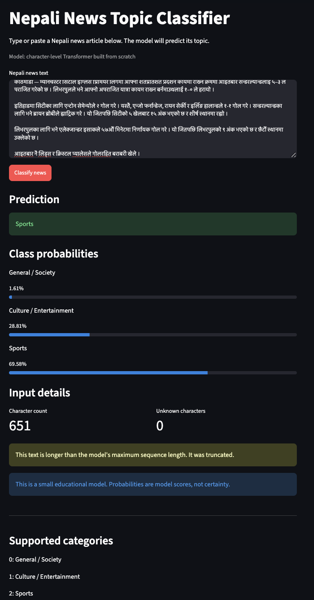
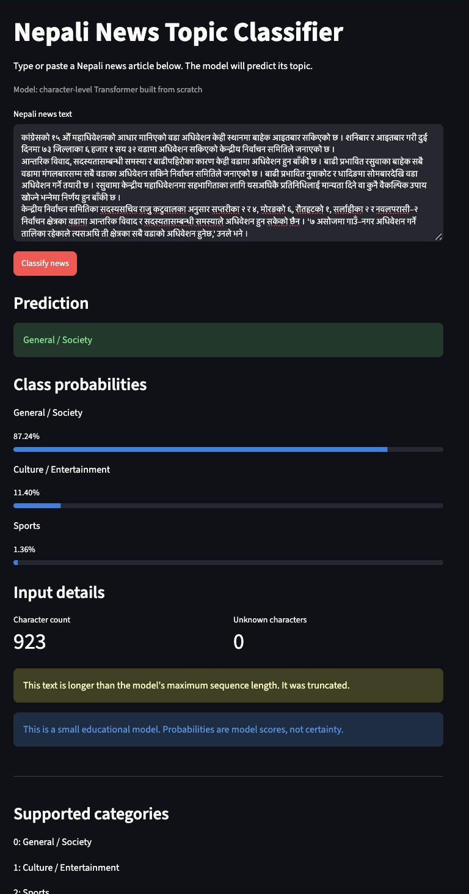
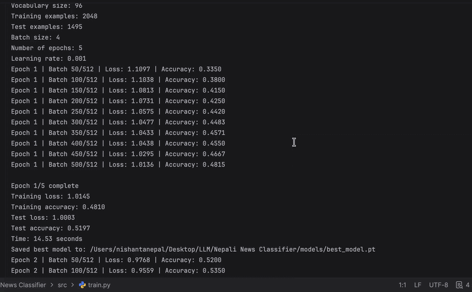

# Nepali News Topic Classifier(Character based tokenization)

A small Transformer encoder built from scratch in PyTorch for classifying Nepali news articles into three topic categories:

- General / Society
- Culture / Entertainment
- Sports

The main purpose of this project is: to understand how a Transformer works internally by implementing the tokenizer pipeline, embeddings, positional embeddings, self-attention, multi-head attention, a Transformer encoder block, the classification head, training loop, evaluation, and a small Streamlit application.

## Demo

The trained model is available through a local Streamlit interface. Users can enter Nepali news text and receive:

- Predicted category.
- Class probabilities.
- Character count.
- Unknown-character count.
- A warning when the input is longer than the model's maximum sequence length.

### Sports example



Example output:

```text
Prediction: Sports

General / Society:        1.61%
Culture / Entertainment: 28.81%
Sports:                  69.58%
```

### General / Society example



Example output:

```text
Prediction: General / Society

General / Society:        87.24%
Culture / Entertainment: 11.40%
Sports:                   1.36%
```

The screenshots also demonstrate the truncation warning for long articles. The model accepts a maximum of 320 character-token positions, so longer inputs are truncated.

## Results

The model was trained for five epochs on the `NepaliNewsClassification` dataset.

### Epochs outputs:




| Epoch | Training loss | Training accuracy | Test loss | Test accuracy |
|---:|---:|---:|---:|---:|
| 1 | 1.0145 | 48.10% | 1.0003 | 51.97% |
| 2 | 0.8441 | 61.04% | 0.7293 | 69.16% |
| 3 | 0.6463 | 73.93% | 0.6360 | 74.38% |
| 4 | 0.5825 | 76.27% | 0.7023 | 72.04% |
| 5 | 0.5298 | 78.91% | 0.6571 | 75.12% |

Best test accuracy:

```text
75.12%
```

Final evaluation:

```text
Correct predictions: 1123 / 1495
Overall accuracy:    0.7512
Macro-F1:            0.7389
```

### Per-class metrics

| Category | Precision | Recall | F1-score | Support |
|---|---:|---:|---:|---:|
| General / Society | 0.6538 | 0.8627 | 0.7439 | 510 |
| Culture / Entertainment | 0.9048 | 0.5055 | 0.6486 | 451 |
| Sports | 0.7982 | 0.8521 | 0.8243 | 534 |

The model performs best on sports. The main weakness is recall for culture and entertainment: many culture and entertainment articles are classified as general or society.

### Confusion matrix

Rows are actual labels and columns are predicted labels.

| Actual / Predicted | General / Society | Culture / Entertainment | Sports |
|---|---:|---:|---:|
| General / Society | 440 | 14 | 56 |
| Culture / Entertainment | 164 | 228 | 59 |
| Sports | 69 | 10 | 455 |

## Dataset

This project uses [`mteb/NepaliNewsClassification`](https://huggingface.co/datasets/mteb/NepaliNewsClassification), a Nepali news classification dataset hosted on Hugging Face.

The downloaded data was saved locally as Parquet files:

```text
data/raw/train.parquet
data/raw/test.parquet
```

Dataset statistics:

| Split | Number of articles |
|---|---:|
| Train | 2,048 |
| Test | 1,495 |

The dataset provides integer labels. This project interprets them as:

```python
LABEL_NAMES = {
    0: "general_society",
    1: "culture_entertainment",
    2: "sports",
}
```

## Model architecture

The classifier is a small encoder-only Transformer implemented manually with PyTorch modules and tensor operations.

```text
Nepali text
    ↓
Character tokenizer
    ↓
Token IDs
    ↓
Token embeddings + positional embeddings
    ↓
Multi-head self-attention
    ↓
Residual connection + layer normalization
    ↓
Feed-forward network with GELU
    ↓
Residual connection + layer normalization
    ↓
<BOS> representation
    ↓
Linear classification head
    ↓
Three class logits
```

### Configuration

| Component | Value |
|---|---:|
| Vocabulary size | 96 |
| Maximum sequence length | 320 |
| Embedding dimension | 64 |
| Number of attention heads | 4 |
| Dimension per attention head | 16 |
| Feed-forward hidden dimension | 128 |
| Transformer encoder blocks | 1 |
| Number of classes | 3 |
| Trainable parameters | 60,291 |

### Self-attention

The project implements scaled dot-product attention:

```text
Attention(Q, K, V)
=
softmax(QKᵀ / √dₖ)V
```

Multi-head attention uses four heads of 16 dimensions each, then combines their outputs back into the 64-dimensional model representation.

### Classification representation

Every sequence begins with a `<BOS>` token. After the encoder block, the final representation at position zero is used as a summary of the article:

```python
bos_representation = encoder_output[:, 0, :]
```

The classification layer maps this 64-dimensional vector to three logits.

## Tokenization

For learning purposes, this project uses a character-level tokenizer implemented from scratch.

Special tokens:

| Token | ID | Purpose |
|---|---:|---|
| `<PAD>` | 0 | Padding shorter sequences |
| `<UNK>` | 1 | Unknown characters |
| `<BOS>` | 2 | Beginning of sequence |
| `<EOS>` | 3 | End of sequence |

The vocabulary is saved to:

```text
data/processed/character_vocab.json
```

Each example is converted to:

```python
{
    "input_ids": [...],
    "attention_mask": [...],
    "label": 2,
}
```

The encoded files are saved to:

```text
data/processed/train_encoded.json
data/processed/test_encoded.json
```

### Sequence length decision

The project selected `MAX_LENGTH = 320` after measuring tokenized article lengths:

| Maximum length | Train truncated | Test truncated |
|---:|---:|---:|
| 128 | 86.91% | 87.09% |
| 192 | 50.78% | 49.97% |
| 256 | 17.53% | 17.39% |
| 320 | 3.27% | 3.75% |
| 384 | 0.24% | 0.47% |
| 512 | 0.00% | 0.00% |

A length of 320 was chosen as a compromise between retaining article content and limiting the quadratic cost of self-attention.

## Project structure

```text
nepali-news-classifier/
├── app/
│   └── streamlit_app.py
├── data/
│   ├── raw/
│   │   ├── train.parquet
│   │   └── test.parquet
│   └── processed/
│       ├── character_vocab.json
│       ├── train_encoded.json
│       └── test_encoded.json
├── models/
│   └── best_model.pt
├── src/
│   ├── stage1_explore.py
│   ├── character_tokenizer.py
│   ├── prepare_data.py
│   ├── news_dataset.py
│   ├── embedding_demo.py
│   ├── positional_embedding_demo.py
│   ├── self_attention.py
│   ├── multi_head_attention.py
│   ├── encoder_block.py
│   ├── classifier.py
│   ├── train.py
│   ├── evaluate.py
│   └── predict.py
├── requirements.txt
└── README.md
```

The files in `src` are intentionally separated by learning stage so that each Transformer component can be inspected independently.

## Installation

Clone the repository:

```bash
git clone (https://github.com/rubeshnpl13/Nepali-News-Classifier-)
cd nepali-news-classifier
```

Create and activate a virtual environment:

```bash
python3 -m venv .venv
source .venv/bin/activate
```

Install the dependencies:

```bash
pip install -r requirements.txt
```

If `requirements.txt` has not been generated yet, install the main dependencies manually:

```bash
pip install torch datasets pandas streamlit
```

The model itself does not use the Hugging Face `transformers` library.

## Download and prepare the dataset

Run the Stage 1 script:

```bash
python src/stage1_explore.py
```

This downloads `mteb/NepaliNewsClassification` through the Hugging Face Datasets library and saves:

```text
data/raw/train.parquet
data/raw/test.parquet
```

Build and save the character vocabulary:

```bash
python src/character_tokenizer.py
```

Prepare fixed-length encoded data:

```bash
python src/prepare_data.py
```

This creates:

```text
data/processed/character_vocab.json
data/processed/train_encoded.json
data/processed/test_encoded.json
```

## Train the model

Run:

```bash
python src/train.py
```

The training script:

1. Loads the encoded training and test data.
2. Creates the Transformer classifier.
3. Runs the forward pass.
4. Calculates cross-entropy loss.
5. Backpropagates gradients.
6. Updates the parameters with Adam.
7. Evaluates after each epoch.
8. Saves the best checkpoint.

The best checkpoint is saved to:

```text
models/best_model.pt
```

## Evaluate the model

Run:

```bash
python src/evaluate.py
```

The evaluation script calculates:

- Overall accuracy.
- Confusion matrix.
- Per-class precision.
- Per-class recall.
- Per-class F1-score.
- Macro-F1.
- Misclassified examples and prediction probabilities.

## Run the Streamlit application

From the project root:

```bash
streamlit run app/streamlit_app.py
```

Or with `uv`:

```bash
uv run streamlit run app/streamlit_app.py
```

The application opens a local browser page: http://localhost:8501/. Enter Nepali news text and click **Classify news**.

## Limitations

This project has several important limitations:

- The dataset is small for a language-model project.
- The tokenizer is character-level rather than subword-based.
- The model has only one Transformer encoder block.
- The model is trained only for three broad categories.
- Long inputs are truncated to 320 token positions.
- The test split was used during development to select the best checkpoint. A future version should create separate training, validation, and test splits.
- The displayed softmax values should not be interpreted as calibrated probabilities.
- Classification performance may not generalize to social-media Nepali, Romanized Nepali, code-mixed text, or other news domains.


## Learning outcomes

This project covers:

- Vocabulary construction.
- Token IDs.
- Padding and truncation.
- Attention masks.
- Token embeddings.
- Positional embeddings.
- Query, key, and value projections.
- Scaled dot-product attention.
- Multi-head attention.
- Residual connections.
- Layer normalization.
- GELU feed-forward networks.
- Classification heads and logits.
- Cross-entropy loss.
- Backpropagation and optimization.
- Evaluation and error analysis.
- Local model deployment with Streamlit.


## Author

Built as a hands-on learning project to understand Transformers, low-resource Nepali NLP, and end-to-end machine-learning system development.
